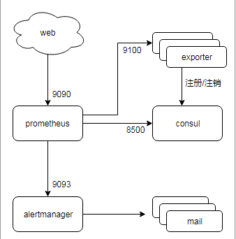
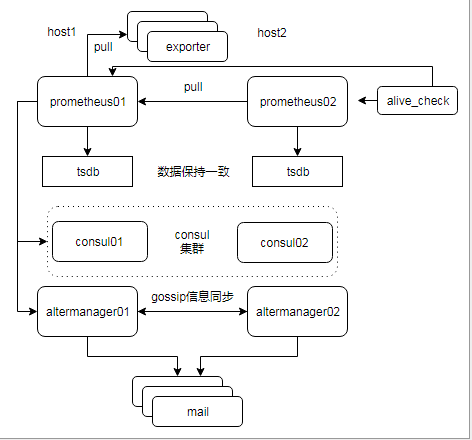

# Prometheus 安装


## 安装前准备

1. 安装docker
	
	```shell
	curl -sSL https://get.daocloud.io/docker > docker.sh  
	bash docker.sh
	```

2. 替换国内docker源加速  
	
	```shell
	touch /etc/default/docker && echo "DOCKER_OPTS=\"--registry-mirror=https://registry.docker-cn.com\"" > /etc/default/docker
	```

3. 关闭主机防火墙
	
	```
	systemctl stop firewalld.service
	```

## 获取资源
1. 拉取标准容器镜像，如果timeout多试几次
	
	```shell
	docker pull prom/prometheus  
	docker pull prom/alertmanager  
	docker pull consul  
	```

2. 准备部署测试机
	
	```shell
	OS:CentOS-7.5.1804
	host1:192.167.67.131  
	host2:192.167.67.132
	```


## 单机部署：

结构图如下：



1. run consul
	```shell
	docker run --name consul01 -d -p 8300:8300 -p 8400:8400 -p 8500:8500 -p 8600:8600 consul
	```

2. run alertmanager

	配置文件/app/docker/alertmanager/alertmanager.yml

	```shell
	docker volume create alertmanager-data
	docker run --name alertmanager01 --volume alertmanager-data:/alertmanager --volume /app/docker/alertmanager:/etc/alertmanager -d -p 9093:9093 -p 9094:9094 prom/alertmanager --config.file=/etc/alertmanager/alertmanager.yml --web.listen-address=":9093" --cluster.listen-address=":9094"
	```

3. run prometheus

	 配置文件/app/docker/prometheus/prometheus.yml 的scrape_configs里加入从consul拉取exporter的配置

	```yaml
	  - job_name: 'consul'
	    scheme: http
	    consul_sd_configs:
	      - server: 192.168.67.131:8500
	        scheme: http
	        services: []
	```
	
	```shell
	docker volume create prometheus-tsdb
	docker run --name prometheus01 --volume prometheus-tsdb:/prometheus --volume /app/docker/prometheus:/etc/prometheus  -d -p 9090:9090  prom/prometheus --config.file=/etc/prometheus/prometheus.yml --web.enable-lifecycle
	```

	reload配置 

	```
	curl -X POST http://127.0.0.1:9090/-/reload
	```

4. 注册exporter

	```shell
	curl -X PUT -d '{"id": "node31","name": "node31","address": "192.168.67.131","port": 9100,"tags": ["host"],"checks": [{"http": "http://192.168.67.131:9100/","interval": "10s"}]}' http://127.0.0.1:8500/v1/agent/service/register
	```
5. 注销exporter

	```shell
	curl -X PUT http://127.0.0.1:8500/v1/agent/service/deregister/node29
	```


## 主备部署




```
alive_check可以部署在host2上去检测prometheus01的状态
if prometheus01 down 
    检测host1的状态
    if host1 up
        尝试一定次数去把prometheus01拉起，如果恢复了->return
    修改prometheus02配置并reload配置去启用备节点
```

1. host1 & host2 run consul
	
	```shell
	docker run --name consul01 -d -p 8300:8300 -p 8400:8400 -p 8500:8500 -p 8600:8600 consul
	```

2. host1 run alertmanager

	```shell
	docker volume create alertmanager-data
	docker run --name alertmanager01 --volume alertmanager-data:/alertmanager --volume /app/docker/alertmanager:/etc/alertmanager -d -p 9093:9093 -p 9094:9094 prom/alertmanager --config.file=/etc/alertmanager/alertmanager.yml --web.listen-address=":9093"  --cluster.listen-address=":9094"
	```

3. host2 run alertmanager

	在alertmanager.yml里配置不同的group_wait，为了防止极端情况下备节点告警时还没收到主节点的相关告警信息，让备节点等待一点时间

	```shell
	docker volume create alertmanager-data
	docker run --name alertmanager02 --volume alertmanager-data:/alertmanager --volume /app/docker/alertmanager:/etc/alertmanager -d -p 9093:9093 -p 9094:9094 prom/alertmanager --config.file=/etc/alertmanager/alertmanager.yml --web.listen-address=":9093" --cluster.listen-address=":9094" --cluster.peer="192.168.67.131:9094"
	```

4. host1 run prometheus

	```shell
	docker volume create prometheus-tsdb
	docker run --name prometheus01 --volume prometheus-tsdb:/prometheus --volume /app/docker/prometheus:/etc/prometheus  -d -p 9090:9090  prom/prometheus --config.file=/etc/prometheus/prometheus.yml --web.enable-lifecycle
	```

5. host2 run prometheus
	修改prometheus.yml，把01里的consul scrape改成去拉01节点prometheus的数据targets:'192.168.67.131:9090'，同步01的数据

	```yaml
	  - job_name: 'federate'
	    scrape_interval: 10s
	    honor_labels: true
	    metrics_path: '/federate'
	    params:
	      'match[]':
	        - '{job="prometheus"}'
	        - '{__name__=~"job:.*"}'
	        - '{__name__=~"node.*"}'
	    static_configs:
	      - targets:
	        - '192.168.67.131:9090'
	```

	```shell
	docker run --name prometheus02 --volume prometheus-tsdb:/prometheus --volume /app/docker/prometheus:/etc/prometheus  -d -p 9090:9090  prom/prometheus --config.file=/etc/prometheus/prometheus.yml --web.enable-lifecycle
	```

